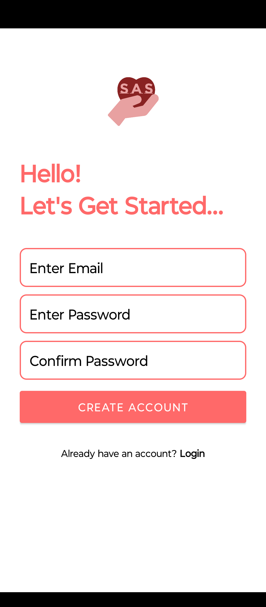
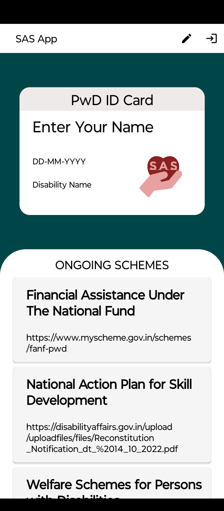
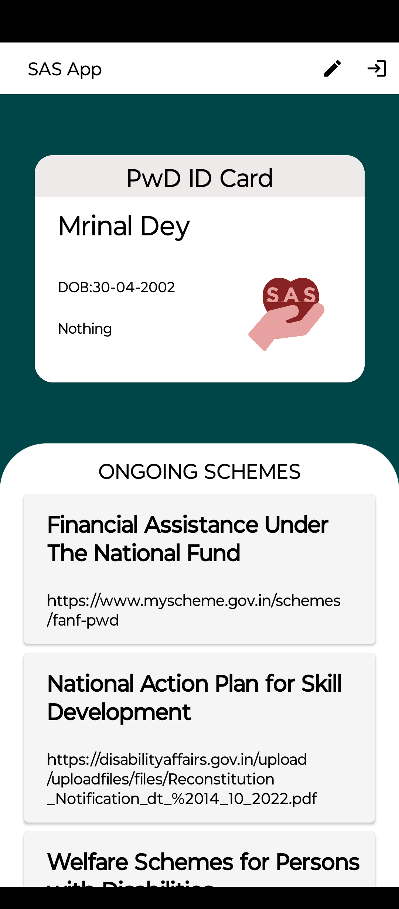

# Specially-Abled Service

An Android application designed to help People with Disabilities (PwD) in India easily access government schemes, services, and essential support resources from their smartphones.

## Overview

Specially-Abled Service is a mobile application developed as a final-year B.Sc. IT project. The goal of the app is to reduce the difficulty faced by specially-abled individuals when searching for government schemes, services, and support systems.

Instead of manually searching through websites or visiting government offices, users can view ongoing schemes, create a virtual ID card, and access relevant information directly from the app.

## Features

* User registration and login using Firebase Authentication
* Email verification system
* Virtual ID card generation for users
* Display of government schemes and services
* Firebase Realtime Database integration
* Lightweight Android application with low RAM usage
* Accessible design focused on ease of use
* Planned support for voice-based features and multilingual accessibility

## Tech Stack

* **Android Studio**
* **Java**
* **Firebase**

  * Firebase Authentication
  * Cloud Firestore
  * Firebase Realtime Database
* **XML**

## System Requirements

### Hardware

* Minimum 2GB RAM Android device
* Android 5.0 (Lollipop) or above

### Software

* Android Studio
* Java SDK
* Firebase Services

## Project Structure

The project follows the Software Development Life Cycle (SDLC) using the **Incremental Model** approach.

Main modules include:

* Authentication & Login
* Registration
* Scheme Viewer
* Virtual ID Card
* Edit Profile / ID Details

## Testing

The application was tested using:

* Unit Testing
* Integration Testing
* System Testing
* Acceptance Testing

### Sample Test Cases

* Login with valid credentials
* Login without email verification
* Registration validation
* Database data retrieval
* ID card generation and updates

## Images

### Splash Screen

### Login Screen

### Home Screen

### ID Card

## Future Improvements

Planned enhancements include:

* Voice search support
* Multilingual support
* Government office locator using maps
* Dedicated helpline section
* Crash and stability improvements

## Limitations

* Requires internet connectivity
* Some bugs and crashes still need optimization

## Learning Outcomes

This project provided hands-on experience with:

* Android app development
* Firebase integration
* Authentication systems
* Database handling
* Software testing methodologies
* UML and SDLC concepts

## Author

Mrinal Dey

## References

* [Firebase Documentation](https://firebase.google.com/docs)
* [Android Developers Documentation](https://developer.android.com/docs)
* [Stack Overflow](https://stackoverflow.com)
* [Swavlamban Card Portal](https://www.swavlambancard.gov.in)
